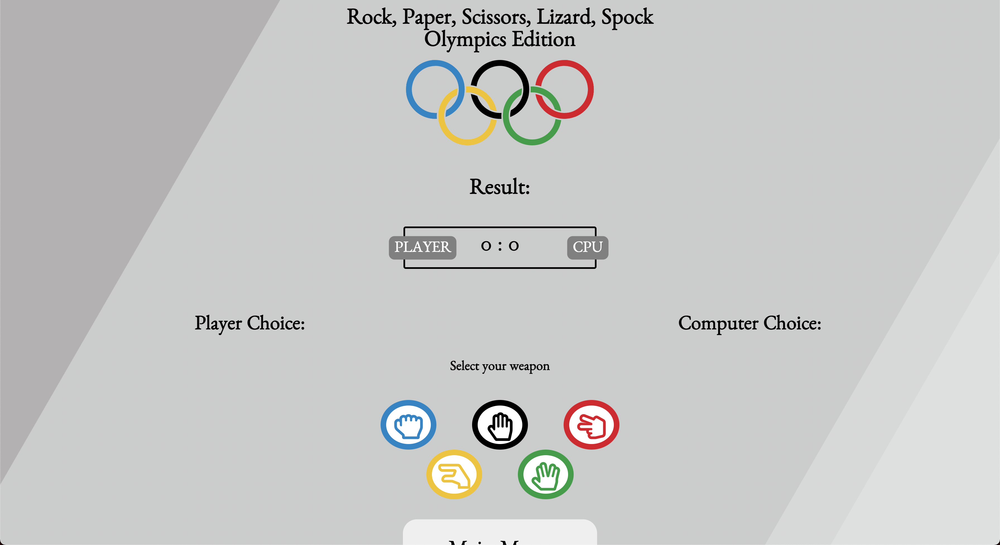

# Rock, Paper, Scissors, Lizard, Spock Olympic Games Edition

## Introduction

Welcome to my second project. This project is a Rock, Paper, Scissors, Lizard, Spock game that involves programming languages like HTML5, CSS3 and JavaScript.
This game will demonstrate basic JavaScript functionality.

A live website can be found [here](https://ikelvvv.github.io/MS2/).

# Table of Contents

-   [1. UX](#ux)
    -   [1.1. Strategy](#strategy)
        -   [Project Goals](#project-goals)
            -   [User Goals:](#user-goals)
            -   [User Expectations:](#user-expectations)
            -   [Trends of Modern Websites](#trends-of-modern-websites)
            -   [Strategy Table](#strategy-table)
    -   [1.2. Structure](#structure)
    -   [1.3. Skeleton](#skeleton)
    -   [1.4. Surface](#surface)
-   [2. Features](#features)
-   [3. Technologies Used](#technologies-used)
-   [4. Testing](#testing)
-   [5. Development Cycle](#development-cycle)
-   [6. Deployment](#deployment)
-   [7. End Product](#end-product)
-   [8. Known Bugs](#known-bugs)
-   [9. Credits](#credits)

# 1. UX

[Go to the top](#table-of-contents)

Everybody knows the basic Rock, Paper, Scissors game, but not everyone knows about the Rock, Paper, Scissors, Liard, Spock game which originated from the TV show, Big Bang Theory. This game adds 2 extra weapons, Lizard and Spock. This changes the who dynamic of the game giving the player/s more variety to win.

## 1.1. Strategy

[Go to the top](#table-of-contents)

### Project Goals

The main goal of this game is to create a fun entertaining game that is interactive to the user and to display the basic use of JavaScript functions.
I want the player to be engaged with the game.

### User Goals:

-   First Time Visitor Goals

*   As a first-time visitor, I want to be engaged with the concept of the game.
*   As a first-time visitor, I want to be able to easily understand the rules of the game.
*   As a first-time visitor, I want to play the game to win.

-   Returning Visitor Goals

*   As a Returning Visitor, I want to beat the computer.
*   As a Returning Visitor, I want to find the best way to get in contact with the organization with any questions I may have.

-   Frequent User Goals

*   As a Frequent User, I want to check to see if there are any newly animations to the weapons.

### User Expectations:

The game should be engaging and display a winner and loser.

-   The weapon selection is clear.
-   The user interface is easy to navigate.
-   The game is responsive on all devices including mobile, tablet and desktop.
-   To have the ability to contact the creator of the game.

### Trends of modern games:

-   Mobile gaming (gaming on the go)
-   Nostalgia gaming with remastered games
-   Virtual reality

### Strategy Table

| Opportunity/Problem/Feature              | Importance | Viability/Feasibility |
| ---------------------------------------- | ---------- | --------------------- |
| Engaging game play                       | 5          | 5                     |
| Score tracking system                    | 5          | 5                     |
| The ability to play against the computer | 5          | 5                     |
| Responsive design                        | 5          | 4                     |
| Contact me form                          | 4          | 5                     |
| Rules popup modal                        | 5          | 5                     |
| Introduction popup modal                 | 5          | 5                     |
| Caption for the winning weapon           | 2          | 1                     |
| Dark mode                                | 2          | 1                     |
| Total                                    | 38         | 36                    |

## Scope

As I am unable to include all of the features from the strategy table. I will phase this project in multiple phases. Phase 1 will be what I have identified as a minimum viable product. Please find below the plans I have for each phase.

### Phase 1

-   Engaging game play
-   Score tracking system
-   The ability to play against the computer
-   Responsive design
-   Contact form
-   Rules popup modal
-   Introduction popup modal

### Phase 2

-   Caption for the winning weapon
-   Dark mode

## 1.2. Structure

[Go to the top](#table-of-contents)

It is really important to include responsive design in this project as many users are using different devices (mobile, tablet, laptop/PC). This gives the user the best experience on their device.

-   Responsive on all device sizes
-   Easy navigation through labelled buttons
-   Footer at the bottom of the index page that links to the social media website.
-   All elements will be consistent including font size, font family, colour scheme.

## 1.3. Skeleton

[Go to the top](#table-of-contents)

I used [Balsamiq](https://balsamiq.com/) to create my wireframes as this gives the template of the UI. This also shows where all elements will be placed within the screen.

There are 2 versions of each wireframe as one shows the design on a web browser and the other shows a mobile browser format.

### Wire-frames

Web browser index page:

Mobile index page:

Web browser introduction modal:

Mobile introduction modal:

Web browser rules modal:

Mobile rules modal:

Web browser contact modal:

Mobile contact modal:

Web browser start game:

Mobile start game:

Web browser player win:

Mobile player win:

Web browser player lost:

Mobile player lost:

Web browser player tie:

Mobile player tie:

## 1.4. Surface

[Go to the top](#table-of-contents)

### Colours

Please find the colours schemes that I used [here](https://coolors.co/f0ffff-0085c7-df0024-f4c300-009f3d).

### Typography

I decided to use Benne as my font of choice with sans serif as my backup font for browsers that might not support Benne.

# 2. Features

[Go to the top](#table-of-contents)

### All Pages

-   Title and logo are placed at the top of the page.
-   Animated background - to give more of a user experience instead of a plain background.

### Landing Page

-   Introduction button - This button opens up a popup modal. This modal gives an introduction to where the game was initially created. There is also an embedded video of the scene at which the game was created.

-   Rules button - This button opens up a popup modal. This modal explains all the rules for the game. Listing the winning possibilities of each weapon. There is also a diagram to show the winning outcomes.

-   Start game button - This button will allow the user to navigate to the game page.

-   Contact button - This button opens up a popup modal. In this modal, the user can fill out a contact form to contact the owner of the website/game.

-   Footer - The footer is placed at the bottom of this page. This contains all social media links that open up in a new tab. When hovering over each icon, the icon magnifies.

### Game Page

-   Results - The results section of the page shows the user the outcome of the round.

-   Scoreboard - The scoreboard shows the current score between user and computer. When the player/CPU wins the player or CPU badge will turn green, this indicates that the player/CPU has won the round. When the player/CPU loses the player or CPU badge will turn red, this indicates that the player/CPU has lost the round. The badges will turn yellow if the round is a tie.

-   Select your weapon - This section allows the player to select their desired weapon. There are 5 icons rock, paper, scissors, lizard, spock. When hovering over each weapon the icon background changes colour to give the user confirmation before selecting the weapon. The icon colours are also in the order of the Olympic rings.

-   Player/Computer choices - This section shows the selection of weapons made by the player and the generated weapon selection for the computer. This uses the same icons as the initial weapon selection part.

-   Main menu button - This button will take the user back to the index page.

-   Winning GIF - If the user has won 3 rounds, the game ends with a winner's GIF. At this point, this removes all the weapon icons and results and left with a new game button, scoreboard and main menu button. This forces the user to restart the game.

-   Losing GIF - If the computer has beaten the user to 3 rounds, the game ends with a loser's GIF. At this point, this removes all the weapon icons and results and left with a new game button, scoreboard and main menu button. This forces the user to restart the game.

## 3. Technologies Used

[Go to the top](#table-of-contents)

-   [HTML5](https://en.wikipedia.org/wiki/HTML)
    -   The project uses HyperText Markup Language.
-   [CSS3](https://en.wikipedia.org/wiki/CSS)
    -   The project uses Cascading Style Sheets.
-   [JavaScript](https://en.wikipedia.org/wiki/JavaScript)
    -   The project uses JavaScript.
-   [Visual Studio Code](https://code.visualstudio.com/)
    -   The project uses Visual Studio Code.
-   [Chrome](https://www.google.com/intl/en_uk/chrome/)
    -   The project uses Chrome to debug and test the source code using HTML5.
-   [Balsamiq](https://balsamiq.com/)
    -   Balsamiq was used to create the wireframes during the design process.
-   [Google Fonts](https://fonts.google.com/)
    -   Google fonts were used to import the "Benne" font into the style.css file which is used on all pages throughout the project.
-   [GitHub](https://github.com/)
    -   GitHub was used to store the project's code after being pushed from Git.
-   [JS Fiddle](https://jsfiddle.net/)
    -   JS Fiddle was used as a playground to test all my code before committing.

# 4. Testing

[Go to the top](#table-of-contents)

For every element that I added to my HTML, I would add the basic CSS to my stylesheet. I would then use the inspect element to try different styles. Once I've got it to my liking I would copy the CSS from google into my stylesheet. This allows me to keep track of the code I am using.

I also added basic functions for my JavaScript that were empty so i could map out the logic of the game.

### Google Developer Tools

For every element that I added to my HTML, I would add the basic CSS to my stylesheet. I would then use the inspect element to try different styles. Once I've got it to my liking I would copy the CSS from google into my stylesheet. This allows me to keep track of the code I am using.

For all JavaScript functions, i console logged each function to make sure that the output was correct.

### Responsive Tools

I used [Am I Responsive](http://ami.responsivedesign.is/) to make sure that all my pages are responsive to all devices.

### W3C Validator Tools

I used [W3C Markup](https://validator.w3.org/#validate_by_input+with_options) to check for any errors within my HTML pages.
I had no errors in the index and start_game page.

I used [W3C CSS Validation](https://jigsaw.w3.org/css-validator/) to check for any errors within my CSS stylesheet.
I had no errors in my CSS file.

I used [JS Hint](https://jshint.com/) to check for any errors within my JavaScript file.
I had no errors in my JavaScript files.

## Manual Testing

I have tested my site on Safari and google chrome on multiple devices.
I also used [JS Fiddle](https://jsfiddle.net/) as a playground to test all of my code before staging and committing any changes.

These include:

-   iPhone X
-   iPhone XS Max
-   iPad Pro
-   Macbook Pro

Please find below my testing process for all pages via mobile and web:

### All Pages

-   Animated background - I tested this on Chrome and Safari on all devices.

    -   Text:

        -   I checked that all text is in the correct and consistent size and font. I also checked that there were no typos.

    -   Media:

        -   I checked that all images and videos on this page-load. Making sure that the video is played and that all images have alt text if media does not load. It worked as expected.

    -   Responsiveness
        -   I checked that all pages and elements were responsive. Checking each page on mobile and website and adjusting screen size to find breakpoints. It worked as expected.

### Landing Page

-   Game Menu Buttons

    -   Introduction button - When selecting the "introduction" button, a popup modal appears with a short summary of the game with an embedded video. This worked as expected.
    -   Rules button - When selecting the "rules" button, a popup modal appears with rules of the game and a diagram showing the winning outcomes. This worked as expected.
    -   Start game button - When selecting the "start game" button, the browser redirects to the game page. This worked as expected.
    -   Contact button - when selecting the "contact" button, a popup modal appears with a contact form. This worked as expected.

-   Footer

    -   Facebook - When selecting the Facebook icon, a new tab opens and redirects to the Facebook website. It worked as expected.
    -   Twitter - When selecting the Twitter icon, a new tab opens and redirects to the Twitter website. It worked as expected.
    -   YouTube - When selecting the YouTube icon, a new tab opens and redirects to the YouTube website. It worked as expected.
    -   Instagram - When selecting the Instagram icon, a new tab opens and redirects to the Instagram website. It worked as expected.

### Game Page

-   Results - I checked that the result output is displaying the correct caption for the winning / losing outcomes.

-   Scoreboard - I checked that the score board increments the correct score for player and computer.

-   Select your weapon - I checked that the icons are all the same size and display the correct colours when hovering over them.

-   Player/Computer choices - I checked that the player button selected appears in the user choice and that the generated computer choice is displaying correctly.

-   Main menu button - When selecting the "main menu" button, the browser redirects to the index page.

-   Winning GIF - I checked that the winning GIF is displaying correcting on all devices, ensuring that the GIF is responsive.

-   Losing GIF - I checked that the losing GIF is displaying correcting on all devices, ensuring that the GIF is responsive.

# 5. Development Cycle

[Go to the top](#table-of-contents)

There were some elements I changed, re-positioned and added from my original wireframes as they were more visually appealing.

### Landing Page

-   I didn't change anything on the landing page. All elements were exactly how I imagined from the initial wireframe.

### Game Page

-   From the original start game wireframe, there wasn't a results section to caption the winning outcomes. I added this in so the user knows exactly the outcome of the round.
-   Added player and CPU labels to the scoreboard.
-   Added the Olympic rings logo to this page so the weapons colours can correspond to the colours.
-   The player and computer choice circles were removed to save space, I decided to show display them under the player/computer choice headings.
-   The scoreboard labels change colour depending on the outcome of the round instead of the player/computer selection circle.
-   Added game winning/losing GIFs.

# 6. Deployment

[Go to the top](#table-of-contents)

I used GitHub pages to deploy my final project. To do this I had to:

1. Create a repository on GitHub.
2. Clone the repository on your chosen source code editor (Visual Studio Code in my case) using the clone link.
3. Add files to Git (staging area) and use the Visual Studio Code to commit changes.
4. Use the terminal within Visual Studio Code to push the code.
5. Go to GitHub and load your repository.
6. Select settings.
7. Select pages on the left menu bar.
8. Click on the master branch.
9. This will now generate a link with your website live.

# 7. End Product

[Go to the top](#table-of-contents)

Please fine below a screenshot of each page:

Home page UI:

Start Game Page UI:

Mid Game Page UI:

Winning Page:

Losing Page:

# 8. Known Bugs

[Go to the top](#table-of-contents)

-   The close "x" button on the popup modals for the index page is not centred. This was rectified by adding padding to the top of the close button.

-   The player/CPU labels on the scoreboard for the game page is not vertically aligned. This was rectified by adding padding to the bottom.

-   The placeholder text for the contact form popup modal to close to the left and top side, making the character of the input text hard to read. The was rectified by adding padding to the left side and padding to the top for the message input.

# 9. Credits

[Go to the top](#table-of-contents)

### Code

-   The popup modals come from [JS Fiddle](https://jsfiddle.net/kumarmuthaliar/GG9Sa/1/)
-   The background animation came from [Code Pen](https://codepen.io/anon/embed/RZogMa?height=500&theme-id=1&slug-hash=RZogMa&default-tab=result#css-box)

### Content

-   All images came from [Google Images](https://www.google.com/imghp?hl=en)
-   All weapon icons came from [Font Awesome](https://fontawesome.com/v5.15/icons?d=gallery&p=2)
-   The winner and loser GIFs came from [GIPHY](https://giphy.com/)
-   The game rules came from [Big Bang Theory Wiki](https://bigbangtheory.fandom.com/wiki/Rock,_Paper,_Scissors,_Lizard,_Spock)
